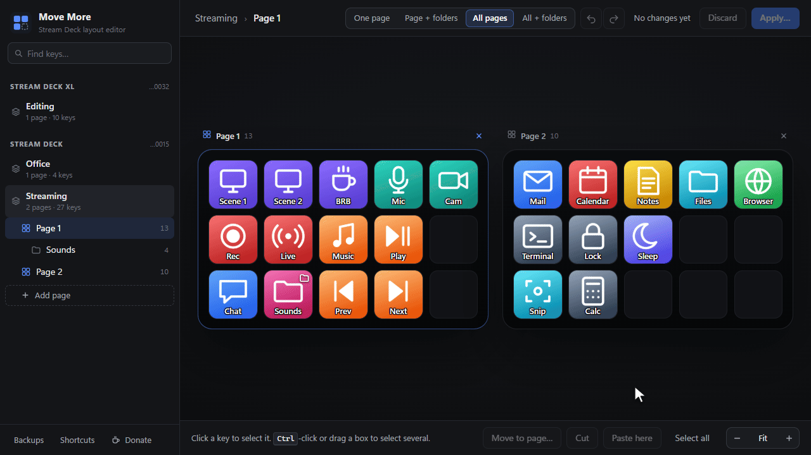

# Move More for Stream Deck

Select several keys at once and move them together: around a page, to another page, or into a folder, with pages and folders side by side. The Stream Deck app only lets you drag one key at a time; Move More gives you a layout editor with multi-select, search, zoom, and page management (add, reorder, delete).



Move More is free and open source ([MIT](LICENSE)). If it saves you time, you can [buy me a coffee](https://buymeacoffee.com/viksra).

## How it works

Stream Deck's plugin SDK has no way to rearrange keys, so Move More edits the profile files directly, carefully:

1. The plugin adds a **Layout Editor** action. Pressing that key opens the editor in your browser (`http://127.0.0.1:38457/`), on the profile that deck shows.
2. You rearrange keys there. Nothing is written until you press **Apply**.
3. On Apply, Move More:
   - checks that no keys or pages were added, moved or removed in Stream Deck in the meantime,
   - **backs up the whole profile**,
   - closes Stream Deck (profile files can't change while it runs), writes the new layout, and starts Stream Deck again (a few seconds).
4. Every change can be undone from **Backups** in the editor.

The editor also follows Stream Deck live: what you change in the Stream Deck app shows up in the editor as soon as Stream Deck saves it, and when you switch to another profile in Stream Deck, the editor switches too.

## Install

Download `com.viksra.movemore.streamDeckPlugin` from the [latest release](../../releases/latest) and double-click it; Stream Deck installs it. (To build it yourself, see *Development*.) Then drag **Move More → Layout Editor** from the actions list onto any key.

You can also open the editor without a key: run `streamdeck://plugins/message/com.viksra.movemore/open` (Win+R), or bookmark `http://127.0.0.1:38457/` while Stream Deck is running.

Requirements: Windows 10/11 and Stream Deck 7.0 or later (profiles in `%APPDATA%\Elgato\StreamDeck\ProfilesV3`).

## Using the editor

| Do this | To |
| --- | --- |
| Click, **Ctrl**-click | Select a key; add or remove keys |
| **Shift**-click | Select the rectangle between two keys |
| Drag on empty space | Draw a box to select keys |
| Drag selected keys | Move them together, with a live preview |
| **← ↑ → ↓** | Nudge the selection by one key |
| Hold dragged keys over a folder key | After a moment the folder key lights up green; drop to put the keys inside that folder |
| **Page + folders**, **All pages**, **All + folders** (top bar) | See the active page with its folders, every page, or every page and folder side by side |
| **+** next to a page or folder in the sidebar, or **Ctrl**-click it | Show just that one alongside the others |
| Drag selected keys onto another page or folder shown | Drop them on an exact slot there (near the edge, the view scrolls) |
| Drop on a page in the sidebar, or **Move to page…** | Move to another page or folder |
| **Ctrl+X**, open a page, click a slot, **Ctrl+V** | Move to an exact spot on a page that isn't shown |
| **Ctrl+F** (or the search box), then **Enter** / **Shift+Enter** | Find keys by title, action, plugin, URL, file or hotkey; Enter selects the next match |
| **Ctrl+A** | Select all keys on the page; while searching, all matches on the page |
| **Ctrl**+scroll, **Ctrl++** / **Ctrl+−** / **Ctrl+0**, or **− Fit +** | Zoom the keys in or out, or back to fit the window |
| Hover a key | See what it does (URL, file, hotkey, page it opens, …) and, if it moved, where it came from |
| Drag a page in the sidebar, or use its **⋯** menu | Reorder pages, add a page, delete an empty page |
| Double-click a folder key | Open the folder |
| **Ctrl+Z** / **Ctrl+Y** | Undo / redo |

With several pages shown, the decks arrange themselves to keep keys as large as possible, and the active page (the one your selection, arrow keys and paste apply to) is outlined. **All + folders** lists each page followed by its folders, like the sidebar; with many folders the view scrolls, and dragging a key near its top or bottom edge scrolls it for you. Zoom in when keys get too small to read; switching views returns to fit. Close a page with its **×**, or go back with **One page**. The editor remembers which pages you had open.

### Pages

Add pages with **Add page** at the end of the page list (or **Add page after** in a page's **⋯** menu), reorder them by dragging them in the sidebar, and delete empty ones. New pages are created on disk when you apply. Keys that open a page by its number — **Go to Page** keys, and **Switch Profile** keys in any profile that open this profile at a page — are renumbered so they keep opening the same page. A page can't be deleted while it still has keys, or while such a key points at it.

### Live updates

Edits you make in the Stream Deck app appear in the editor right after Stream Deck saves them, and so do new, renamed and deleted profiles. New titles, icons or key states, and switching pages on the device, never get in the way of your unapplied changes. If keys or pages are added, moved or removed in Stream Deck while you have unapplied changes, the editor keeps showing your version but won't apply it; **Reload latest** starts over from the new layout.

When Stream Deck switches to another profile (you pick one or another device in its window, or press a Switch Profile key), the editor opens that profile within a couple of seconds. With unapplied changes it doesn't switch; it tells you, and **Switch to it…** switches after you confirm. You can still open any profile from the sidebar; the editor only follows the next switch.

### Moving rules

Keys never get overwritten or lost:
- **Same page:** keys in the way slide into the space the selection left, following the move direction. Drag a row one step right and the key at its end wraps to the start.
- **Dragging onto another page or folder shown, or cut & paste:** a key in the way swaps with the key that takes its place, so it goes back to where you dragged from. The live preview shows it before you let go.
- **Sidebar drop or "Move to page":** keys keep their positions if those are free, shift as little as possible if not, or fill free slots in reading order. Keys already on that page are never moved.

A blue dot marks every key that will move, and pages with unapplied changes get a dot in the sidebar.

## Safety

- **Backups:** the whole profile is copied to `%APPDATA%\StreamDeckMoveMore\backups\` before every change (the 40 newest are kept), and so is every other profile whose Switch Profile keys get renumbered. Restore one from **Backups** in the editor. Restoring also backs up the current state first.
- **Conflict checks:** if keys or pages were added, moved or removed in Stream Deck after the editor loaded the profile, nothing is written and the editor asks you to reload. Anything else Stream Deck saved in the meantime (titles, icons, settings, key states) is kept, because the new layout is built from the files as they are at that moment. Files are re-checked after Stream Deck has closed, right before writing.
- **All-or-nothing writes:** if any file fails to write, everything already written is rolled back.
- **Folder rules:** the Parent Folder key inside each folder is locked, and a folder key can't be moved into its own folder (the folder would become unreachable).
- **Images:** when a key moves to another page, its custom image moves with it (each page keeps its own `Images` folder); name clashes are resolved automatically.
- The editor server only listens on `127.0.0.1` and only accepts changes from its own page. For live updates it only watches the profiles folder for changes; it never locks files, so Stream Deck can save, rename and delete them as usual. To follow profile switches it reads (never writes) Stream Deck's device settings in the registry (`HKCU\Software\Elgato Systems GmbH\StreamDeck`, value `Devices`), while an editor page is open.

Stream Deck also keeps its own backups (Preferences → Profiles → Backups).

## Limitations

- Windows only.
- Keys on the keypad only. Dials and touch strips (Stream Deck +) are preserved but not moved.
- Keys move within one profile, not between profiles or devices.
- Some marketplace plugins encrypt their manifest, so their keys show as a text tile instead of the default icon when they have no custom image.
- The key preview explains Stream Deck's own actions (websites, files, apps, hotkeys, sounds, page and profile links, multi-actions). Other plugins' settings aren't read, and Text keys never show what they type.
- Applying restarts Stream Deck, which also restarts all plugins.
- Following profile switches relies on how Stream Deck stores its settings, which Elgato doesn't document. If an update changes that, the editor stops following (and says so in the plugin log) but works otherwise.

## Development

```powershell
npm install
npm run build      # bundles src/ into com.viksra.movemore.sdPlugin/bin
npm test           # unit + integration tests (node:test)
npm run typecheck
npm run validate   # Elgato's manifest validator
npm run pack       # production build + release/com.viksra.movemore.streamDeckPlugin
```

To try the editor without touching Stream Deck, point the dev server at a **copy** of your profiles folder. It edits that copy directly and never closes Stream Deck:

```powershell
Copy-Item -Recurse "$env:APPDATA\Elgato\StreamDeck\ProfilesV3" C:\temp\ProfilesV3
npm run dev -- --profiles C:\temp\ProfilesV3
# open http://127.0.0.1:38460/
```

The dev server follows the profile Stream Deck shows, like the plugin. To simulate switching, add `--selection C:\temp\selection.json` and edit that file: `{ "shown": "<device id>", "devices": [{ "id": "<device id>", "name": "Stream Deck XL", "profileId": "<profile id>" }] }` (device ids as in a profile's `manifest.json`, `Device.UUID`).

For live development against Stream Deck: `npx streamdeck link com.viksra.movemore.sdPlugin`, then `npm run watch` and `npx streamdeck restart com.viksra.movemore` after changes. Plugin logs are in `com.viksra.movemore.sdPlugin/logs/`, and each apply writes `helper.log` into its transaction folder under `%APPDATA%\StreamDeckMoveMore\transactions\`.

### Layout

```
src/
  plugin.ts             Stream Deck entry: Layout Editor action, editor server
  apply-helper.ts       separate process: closes Stream Deck, applies, restarts it
  server/               HTTP API, live change feed (profile watcher), editor view model
  profiles/             ProfilesV3 reader, move planner (validation, image handling), devices, icons,
                        the profile Stream Deck shows (from its registry settings)
  apply/                backups, staged transactions, executor with rollback
com.viksra.movemore.sdPlugin/
  manifest.json
  editor/               the browser editor (plain HTML/CSS/JS; layout-ops.js is the pure move logic)
  ui/                   property inspector
test/                   node:test suites (fixtures are generated, never your real profiles)
```

## Uninstall

In Stream Deck, open Preferences → Plugins, select Move More and click the minus button. Backups stay in `%APPDATA%\StreamDeckMoveMore` until you delete that folder.

## License

[MIT](LICENSE). Move More is not affiliated with or endorsed by Elgato.
